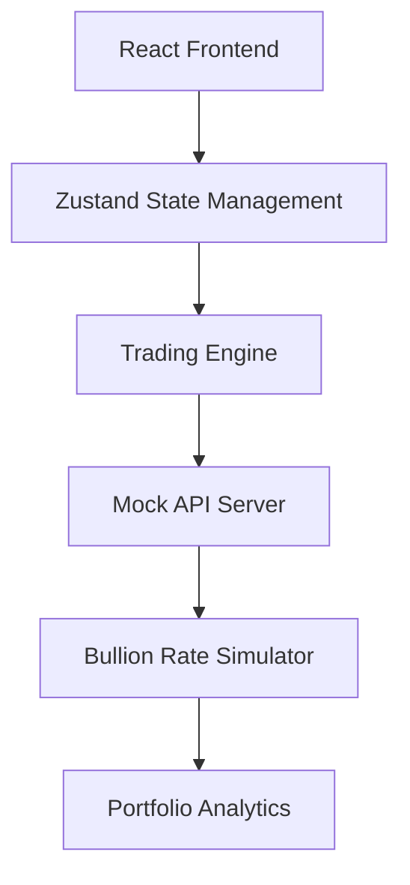

<p align="center">
  
</p>
<div align="center">

# ✨ Bless Investments

### 🟡 Digital Bullion Investment Simulator


<br>


<br><br>


### 💰 Learn • Simulate • Analyze • Invest

</div>

---

## 🌟 Overview

**Bless Investments** is a modern fintech prototype designed to simulate digital bullion investing through an elegant and interactive user experience.

The platform allows users to buy, sell, and track virtual precious metals using simulated market data and virtual funds. Built as a safe sandbox environment, it helps users understand the mechanics of digital gold investing without risking real money.

### Current Features

✅ Virtual Wallet System

✅ Gold & Silver Trading

✅ Live Simulated Market Rates

✅ Portfolio Tracking

✅ Profit / Loss Analytics

✅ Transaction History

✅ Time Advancement Simulation

✅ Responsive Modern UI

---

## ✨ Key Features

### 🔐 Authentication

Secure user access with protected routes and personalized investment portfolios.

### 📊 Smart Dashboard

Monitor your investment performance from a centralized dashboard.

- Wallet Balance
- Portfolio Value
- Active Holdings
- Market Trends
- Live Bullion Rates

### 🪙 Digital Bullion Trading

Simulate investing in precious metals.

#### Supported Assets

- Gold
- Silver

#### Planned Assets

- Platinum
- Palladium

### 📈 Profit & Loss Analytics

Analyze investment performance with:

- Portfolio Growth
- Unrealized Profit
- Historical Performance
- Future Projections

### 📜 Transaction Ledger

Track all activities including:

- Buy Orders
- Sell Orders
- Holdings History
- Investment Timeline

### ⏩ Time Travel Simulation

Advance days, months, or years into the future and visualize how your investments could perform under simulated market conditions.

### 🎨 Luxury UI Experience

Designed with:

- Gold & Silver Theme
- Smooth Animations
- Responsive Layout
- Modern FinTech Aesthetics

---

## 🏗️ Architecture



---

## ⚙️ Tech Stack

<div align="center">

### Frontend


### State Management


### Backend


### Development Tools


</div>

---

## 📂 Project Structure

```bash
src
├── components
│   ├── RateSpark.tsx
│   ├── LivePulse.tsx
│   ├── AppShell.tsx
│   └── styles.css
│
├── hooks
│   ├── bless-store.ts
│   └── use-bless.ts
│
├── lib
│   └── helpers.ts
│
├── routes
│   ├── __root.tsx
│   ├── index.tsx
│   ├── auth.tsx
│   ├── dashboard.tsx
│   ├── trade.tsx
│   └── history.tsx
│
├── router.tsx
├── routeTree.gen.ts
├── server.ts
├── start.ts
└── styles.css
```

---

## 🚀 Getting Started

### Clone Repository

```bash
git clone https://github.com/YOUR_USERNAME/bless-investments.git
cd bless-investments
```

### Install Dependencies

```bash
bun install
```

### Start Development Server

```bash
bun run dev
```

Open:

```bash
http://localhost:5173
```

---

## 📸 Screenshots

### Dashboard

> Add screenshot here

```md

```

### Trading

```md

```

### History

```md

```

---

## 🛣️ Roadmap

### Phase 1 — Prototype

- [x] Authentication
- [x] Dashboard
- [x] Trading Interface
- [x] Transaction History
- [x] Market Simulation
- [x] State Management

### Phase 2 — Advanced Features

- [ ] AI Investment Suggestions
- [ ] Market Event Simulation
- [ ] Watchlists
- [ ] Advanced Analytics

### Phase 3 — Real Market Integration

- [ ] Real-Time Bullion APIs
- [ ] Price Alerts
- [ ] Live Market Data
- [ ] Automated Rate Sync

### Phase 4 — Production Platform

- [ ] KYC Verification
- [ ] Payment Gateway Integration
- [ ] Real Gold Purchases
- [ ] Mobile Application

---

## 🎯 Project Goals

This project explores:

- FinTech Product Development
- Digital Asset Management
- Investment Simulations
- Financial Analytics
- Modern React Architecture
- Scalable State Management

---

## ⚠️ Disclaimer

Bless Investments is currently a simulation platform.

No real financial transactions occur within the application.

All balances, rates, profits, losses, and investment outcomes are generated using mock data for educational and demonstration purposes only.

---

<div align="center">

## 👨‍💻 Developer

### Chris Jeyan

💛 Building the future of digital bullion investing.

⭐ If you like this project, consider giving it a star.

</div>
